# Portfolio Through Line & Strategic Content Map

**Author:** Vivek  
**Target Role:** Junior Backend / Pipeline / Applied AI Engineer  
**Target Audience:** Engineering Managers & Technical Recruiters at Media & Tech Companies  
**Source of Truth:** Repository Project Artifacts (`PORTFOLIO-FL01/`, `FL-01/`, `foundations-app/`, `PROMPT-ITERATION-LOG.md`)  

---

## 1. One-Line Claim

### 10 Concise Alternatives Generated

1. *"I build and optimize Python-based multimedia processing pipelines that eliminate temporal and visual frame artifacts."*
2. *"I develop automated video restoration pipelines in Python, chaining computer vision models to solve multi-face distortion."*
3. *"I engineer Python media processing workflows that resolve data bottlenecks and multi-model synchronization issues."*
4. *"I build AI-assisted backend pipelines that process and restore real-world video footage without visual artifacts."*
5. *"I connect vision models and FFmpeg into robust Python pipelines that diagnose and fix frame-overlap defects."*
6. *"I write modular Python pipelines for media processing, focusing on execution flow optimization and edge-case artifact removal."*
7. *"I architect sequential Python computer vision pipelines that turn raw, degraded footage into artifact-free media."*
8. *"I engineer multimedia data pipelines in Python, debugging frame-matching bottlenecks under practical GPU constraints."*
9. *"I build practical Python vision and media pipelines that solve real frame-overlap errors across scene transitions."*
10. *"I develop Python backend pipelines that coordinate deep learning vision models and video encoders into clean workflows."*

---

### Comparison & Evaluation

| # | Proposed Claim | Strengths | Weaknesses | Assessment |
|---|----------------|-----------|------------|------------|
| 1 | *I build and optimize Python-based multimedia processing pipelines that eliminate temporal and visual frame artifacts.* | Directly names domain (Python multimedia pipelines) and exact technical outcome (eliminating artifacts). | "Temporal and visual frame artifacts" is slightly broad without naming the specific defect. | **Strong Contender** |
| 2 | *I develop automated video restoration pipelines in Python, chaining computer vision models to solve multi-face distortion.* | Highly specific to the actual face-matching / multi-face overlap problem solved in the project. | Narrowed purely to video restoration rather than broader pipeline engineering. | **Top 3 Recommended** |
| 3 | *I engineer Python media processing workflows that resolve data bottlenecks and multi-model synchronization issues.* | Good systems engineering terminology (data bottlenecks, synchronization). | Doesn't explicitly mention the visual/artifact outcome that proves the work. | Good, but abstract |
| 4 | *I build AI-assisted backend pipelines that process and restore real-world video footage without visual artifacts.* | Mentions AI assistance and real-world footage. | "AI-assisted backend" can sound like generic chatbot wrapper work. | Weakened by ambiguity |
| 5 | *I connect vision models and FFmpeg into robust Python pipelines that diagnose and fix frame-overlap defects.* | Names exact core stack tools (vision models, FFmpeg) and the exact defect (frame overlap). | Slightly mechanical phrasing. | **Top 3 Recommended** |
| 6 | *I write modular Python pipelines for media processing, focusing on execution flow optimization and edge-case artifact removal.* | Highlights software modularity and execution flow. | "Focusing on" sounds like an aspiration rather than a demonstrated capability. | Passable |
| 7 | *I architect sequential Python computer vision pipelines that turn raw, degraded footage into artifact-free media.* | Strong active verb ("architect sequential pipelines"). | "Degraded footage" makes unverified assumptions about input quality. | Overclaims source quality |
| 8 | *I engineer multimedia data pipelines in Python, debugging frame-matching bottlenecks under practical GPU constraints.* | Acknowledges real hardware boundaries (GPU constraints) and frame matching. | Slightly dense sentence structure. | Good |
| 9 | *I build practical Python vision and media pipelines that solve real frame-overlap errors across scene transitions.* | Very concrete about the scene-transition edge case diagnosed in the project. | Slightly repetitive ("practical", "real"). | Decent |
| 10 | *I develop Python backend pipelines that coordinate deep learning vision models and video encoders into clean workflows.* | Accurately describes model orchestration and encoding. | Missing the concrete artifact-debugging outcome. | Missing proof hook |

---

### Top 3 Recommended Claims

1. **Option 2:** *"I develop automated video restoration pipelines in Python, chaining computer vision models to solve multi-face distortion."*
2. **Option 5:** *"I connect vision models and FFmpeg into robust Python pipelines that diagnose and fix frame-overlap defects."*
3. **Option 1 (Refined):** *"I build and optimize Python-based multimedia processing pipelines that solve real data bottlenecks and eliminate visual artifacts like frame overlap and distortion."*

---

### Selected Final One-Line Claim

> **"I build and optimize Python-based multimedia processing pipelines that solve real data bottlenecks and eliminate visual artifacts like frame overlap and distortion."**

**Why this is the strongest:**
- **Single Core Engineering Skill:** Python-based multimedia and computer vision pipeline engineering.
- **Specific & Verifiable:** Directly proven by the frame-tracking and face-matcher logic in the Video Restoration project.
- **Targeted:** Speaks directly to Engineering Managers hiring for backend, media-processing, and applied AI workflows.
- **Zero Fluff:** Contains no empty buzzwords ("passionate", "creative", "visionary").

---

## 2. Target Audience

- **Primary Audience:** Engineering Managers, Lead Backend Engineers, and Technical Recruiters at media-tech companies, video platforms, and AI product teams evaluating junior backend/pipeline engineers.
- **Audience Mindset:** Skeptical of generic "AI wrappers" and buzzword-heavy CVs. They look for:
  1. Can this candidate write clean, modular Python?
  2. Do they understand multi-model dataflow, memory constraints, and encoding pipelines?
  3. Can they diagnose and debug real edge cases (e.g. frame overlap, scene transitions)?
  4. Do they know their engineering boundaries without fabricating metrics?

---

## 3. Primary Portfolio Action

> **"Review my technical case studies to evaluate my engineering work."**

Every page, card, button, and layout choice exists to drive the visitor toward reading and verifying the technical case studies.

---

## 4. Project Ranking (Strongest Work First)

```
┌─────────────────────────────────────────────────────────────────────────┐
│                      PROJECT EVIDENCE STRENGTH RANKING                  │
│                                                                         │
│  RANK 1: AI Video Restoration Pipeline (Flagship Evidence)              │
│  RANK 2: AIPS — Academic Intelligence System (Systems Architecture)     │
│  RANK 3: AI-Assisted Engineering Workflow (Process & Hygiene Proof)     │
└─────────────────────────────────────────────────────────────────────────┘
```

### Detailed Ranking Breakdown

| Rank | Project Name | Evidence Strength | Relevance to Primary Claim | Technical Depth | Visual Proof Available | Recommended Position |
| :--- | :--- | :--- | :--- | :--- | :--- | :--- |
| **#1** | **AI Video Restoration Pipeline** | **Highest (Verified Code & Logic)** | **100% Direct Match:** Python pipeline, multi-model chaining, artifact elimination. | PyTorch, InsightFace, Real-ESRGAN, FFmpeg, PySceneDetect, custom frame-tracking. | Before/After frame comparisons showing eliminated overlap; SVG pipeline flow diagram. | **Flagship Lead:** Hero feature on Home, first deep-dive in Work. |
| **#2** | **AIPS (Academic Intelligence System)** | **High (Working App Architecture)** | **Secondary Supporting:** Backend architecture, context assembly, secure key handling. | Next.js, Groq API backend-only proxy, embedding index, verification filter. | Clean system architecture dataflow diagram; real application UI capture. | **Second Project:** Proves full-stack systems understanding beyond Python scripts. |
| **#3** | **AI-Assisted Workflow & Verification** | **Medium-High (Documented Log)** | **Foundational Hygiene:** Demonstrates verification discipline and refusal to hallucinate. | Prompt iteration (V0–V5), step decomposition, conventional git commit history. | Real terminal commit logs; prompt iteration tables; evaluation matrices. | **Supporting / About Feature:** Validates engineering maturity and developer ownership. |

---

## 5. Page-by-Page Content Map

---

### Page 1: `HOME` (Landing & Proof Gateway)

- **Purpose:** Immediately hook the visitor with the core one-line claim, prove credibility with high-density project previews, and funnel ~80% of traffic directly into the primary case studies.
- **Primary CTA:** `Review My Technical Case Studies →` (links to `/work` or `#work-destination`)

#### Section Order & Specifications

1. **Top Navigation Bar:**
   - *Content:* Minimal brand monogram (`VS`), site title, navigation links (`Home`, `Work`, `About`, `Contact`), and quick CTA button.
   - *Evidence/Asset:* Clean 28px square `VS` brand mark with status indicator.
   - *Visitor Takeaway:* "This portfolio is professional, lightweight, and structured."
2. **Hero Section:**
   - *Content:* Developer name (`Vivek Sharma`), headline, and prominent Core Proof Statement.
   - *Evidence/Asset:* High-contrast proof statement box with audience targeting tag.
   - *Visitor Takeaway:* "Vivek builds real Python multimedia pipelines that debug frame artifacts."
3. **Primary Action Strip:**
   - *Content:* Dual action chips for primary destination (`Review Technical Case Studies`) and direct connection (`Connect via GitHub / Email`).
   - *Evidence/Asset:* Interactive semantic pills with hover affordance.
   - *Visitor Takeaway:* Clear paths to evaluate work or reach out immediately.
4. **Featured Work Previews (The Proof Engine):**
   - *Content:* Curated previews of the top 3 ranked projects (AI Video Restoration Pipeline, AIPS, AI-Assisted Engineering).
   - *Evidence/Asset:* Inline pipeline dataflow diagrams (`PySceneDetect → InsightFace → Real-ESRGAN → FFmpeg`) and Before/After artifact comparison boxes.
   - *Visitor Takeaway:* "The candidate has tangible projects with real architecture and visual proof."
5. **Engineering Mindset & Boundary Summary:**
   - *Content:* Short 3-point credibility statement: Academic background (B.Tech CSE), Python pipeline focus, and radical verification honesty (explicit hardware/VRAM boundaries).
   - *Evidence/Asset:* Boundary tag (`Local GPU/VRAM constraints; no cloud scale claimed`).
   - *Visitor Takeaway:* "The candidate is honest, disciplined, and knows their technical limits."
6. **Bottom Conversion Band:**
   - *Content:* Reiteration of the primary action.
   - *Evidence/Asset:* Large solid primary button: `[ Explore All Technical Case Studies ]`.
   - *Visitor Takeaway:* Frictionless transition into deep-dive evidence.

---

### Page 2: `WORK / CASE STUDIES` (Proof & Technical Verification Index)

- **Purpose:** Serve as the centralized index for technical deep-dives, organizing projects by engineering discipline and evidence depth.
- **Primary CTA:** `Read Case Study: AI Video Restoration →` (links to `/work/video-restoration`)

#### Section Order & Specifications

1. **Header & Context:**
   - *Content:* Section eyebrow (`Proof Engine`), Title (`Work / Case Studies`), and description emphasizing verified technical decisions over marketing claims.
   - *Visitor Takeaway:* "These case studies contain reproducible engineering evidence, not fluff."
2. **Flagship Case Study Card (AI Video Restoration Pipeline):**
   - *Content:* Problem summary, verified component stack (`Python`, `PyTorch`, `InsightFace`, `Real-ESRGAN`, `FFmpeg`, `PySceneDetect`), architecture pipeline, and provable outcome.
   - *Evidence/Asset:* Multi-model SVG dataflow ribbon + Before/After frame artifact comparison.
   - *Visitor Takeaway:* "This is a serious pipeline project with real custom logic for frame-matching across scene transitions."
3. **Systems Case Study Card (AIPS):**
   - *Content:* Academic intelligence architecture, context window assembly, secure backend proxying, and offline boundaries.
   - *Evidence/Asset:* Architecture block diagram (Query Parser → Embedding Index → Verification Filter).
   - *Visitor Takeaway:* "The candidate can design secure API integration and systems architectures."
4. **Engineering Workflow & Hygiene Card:**
   - *Content:* Prompt iteration methodology (V0 to V5), step decomposition, and Git commit hygiene.
   - *Evidence/Asset:* Terminal execution log snippet showing Conventional Commits.
   - *Visitor Takeaway:* "The candidate uses AI to accelerate execution while retaining 100% developer ownership and verification."
5. **Index Footer CTA:**
   - *Content:* Direct link to primary case study deep-dive.
   - *Primary CTA:* `[ Open Flagship Case Study ]`.

---

### Page 3: `AI VIDEO RESTORATION CASE STUDY` (Deep-Dive)

- **Purpose:** Provide complete, undeniable technical evidence of pipeline architecture, model orchestration, debugging decisions, and before-and-after artifact resolution.
- **Primary CTA:** `Inspect GitHub Repository & Code →` (links to verified repository)

#### Section Order & Specifications

1. **Case Study Header:**
   - *Content:* Project Title (`AI Video Restoration Pipeline`), domain tags (`[Python]`, `[PyTorch]`, `[InsightFace]`, `[Real-ESRGAN]`, `[FFmpeg]`, `[PySceneDetect]`), and role statement (`Pipeline & Backend Engineering`).
   - *Visitor Takeaway:* "Clear understanding of the candidate's exact role and toolchain."
2. **The Problem (Engineering Challenge):**
   - *Content:* Restoring older wedding/event footage creates severe visual artifacts under multi-model interpolation, specifically face overlapping ("crayon effect") across scene cuts.
   - *Evidence/Asset:* Raw frame capture illustrating face tracking breakdown across hard cuts.
   - *Visitor Takeaway:* "The candidate was solving a specific, difficult technical problem, not running a generic tutorial script."
3. **Pipeline Architecture & Technical Flow:**
   - *Content:* Step-by-step dataflow explanation: (1) Scene boundary detection via `PySceneDetect`, (2) Frame extraction via `FFmpeg`, (3) Face detection & embedding extraction via `InsightFace`, (4) Super-resolution enhancement via `Real-ESRGAN`, (5) Video re-encoding and audio sync via `FFmpeg`.
   - *Evidence/Asset:* Full sequential architectural flow diagram.
   - *Visitor Takeaway:* "The candidate understands end-to-end media pipeline architecture."
4. **Key Engineering Decisions & Debugging:**
   - *Content:* Why custom frame-matcher logic was engineered: to maintain consistent face tracking IDs across scene cuts and prevent the super-resolution model from blending overlapping features.
   - *Evidence/Asset:* Code snippet showing frame-tracking / face-matcher verification logic.
   - *Visitor Takeaway:* "The candidate wrote custom Python logic to solve edge cases rather than relying on out-of-the-box defaults."
5. **Provable Outcome & Before/After Evidence:**
   - *Content:* Side-by-side frame comparison showing artifact-free output on reviewed footage.
   - *Evidence/Asset:* Interactive or side-by-side Before/After comparison box (`Raw Overlap Artifact` vs `Restored Output`).
   - *Visitor Takeaway:* "The solution works and the visual evidence confirms it."
6. **Honest Engineering Boundaries:**
   - *Content:* Explicitly states that the pipeline was constrained by local GPU/VRAM limits, and has not yet been benchmarked on long-form multi-hour streams or cloud multi-tenant infrastructure.
   - *Evidence/Asset:* Highlighted boundary callout box (`Verification Boundary`).
   - *Visitor Takeaway:* "The candidate has high technical integrity and does not make fake claims."
7. **Bottom Navigation / CTA:**
   - *Primary CTA:* `[ Inspect Pipeline Code on GitHub ]` (Secondary: `Next Case Study: AIPS →`).

---

### Page 4: `AIPS CASE STUDY` (Deep-Dive)

- **Purpose:** Prove systems engineering, API security, and intelligent retrieval workflows.
- **Primary CTA:** `Explore AI Workflow Case Study →` (or GitHub repository)

#### Section Order & Specifications

1. **Header & Context:**
   - *Content:* Title (`AIPS — Academic Intelligence System`), tags (`[Next.js]`, `[Groq API]`, `[Backend Proxy]`, `[TypeScript]`).
   - *Visitor Takeaway:* "Candidate has full-stack / backend integration capabilities."
2. **The Problem:**
   - *Content:* Need for an academic assistance tool with structured retrieval and zero client-side API key leakage.
   - *Visitor Takeaway:* "Clear focus on usability and security."
3. **Architecture & Implementation:**
   - *Content:* Secure backend-only API proxying, context assembly, and retrieval filtering.
   - *Evidence/Asset:* Architecture block diagram showing dataflow from query to verified output.
   - *Visitor Takeaway:* "Candidate handles API keys securely on the server side."
4. **Engineering Boundaries:**
   - *Content:* Offline access is currently incomplete and acknowledged as a boundary; live online retrieval is functional.
   - *Evidence/Asset:* Boundary status tag.
   - *Visitor Takeaway:* "Candidate accurately represents current project state."
5. **Bottom CTA:**
   - *Primary CTA:* `[ View Next Case Study: Engineering Workflow ]`.

---

### Page 5: `ABOUT` (Engineering Mindset & Background)

- **Purpose:** Establish personal credibility, academic foundation, and engineering philosophy without distracting from technical project evidence.
- **Primary CTA:** `Review My Technical Case Studies →` (redirects back into the proof engine)

#### Section Order & Specifications

1. **Header & Introduction:**
   - *Content:* Academic foundation: B.Tech in Computer Science and Engineering (CSE). Focus on backend systems, Python multimedia pipelines, and applied AI.
   - *Evidence/Asset:* Real professional photograph (clean, authentic developer headshot).
   - *Visitor Takeaway:* "Vivek is an authentic, grounded engineering student with clear backend focus."
2. **How I Work (AI as a Collaborator):**
   - *Content:* How AI is used to accelerate drafting and debugging, while retaining 100% developer responsibility for architecture, testing, and verification.
   - *Evidence/Asset:* Excerpt from `FL-01 Workflow Audit` classification table.
   - *Visitor Takeaway:* "Candidate uses AI with high maturity and never depends on it for final judgment."
3. **Developer Hygiene & Tooling:**
   - *Content:* Git discipline, Conventional Commits, reproducible local environments.
   - *Evidence/Asset:* Terminal log artifact snippet showing verified commit history.
   - *Visitor Takeaway:* "Candidate writes clean git history and tests code before committing."
4. **Bottom Conversion:**
   - *Primary CTA:* `[ Return to Technical Case Studies ]` (Secondary: `Get in Touch →`).

---

### Page 6: `CONTACT` (Conversion Channels)

- **Purpose:** Provide immediate, frictionless communication channels for recruiters and engineering managers who are ready to connect.
- **Primary CTA:** `Send Direct Email →` (`mailto:`)

#### Section Order & Specifications

1. **Header & Purpose:**
   - *Content:* Clear statement: "Available for Junior Backend, Pipeline, and AI Engineering roles."
   - *Visitor Takeaway:* "Candidate is actively seeking employment and ready for interview discussions."
2. **Direct Communication Channels:**
   - *Content:* Direct Email (`mailto:` link), GitHub profile (`github.com/vivekcyr25`), and LinkedIn.
   - *Evidence/Asset:* High-contrast monospace contact cards with direct clickable links.
   - *Visitor Takeaway:* "Frictionless ways to reach out immediately."
3. **Availability & Status Indicator:**
   - *Content:* Live status indicator: `Available for Internship & Junior Engineering`.
   - *Evidence/Asset:* Green pulse status pill.
   - *Visitor Takeaway:* "Active and responsive."
4. **Fallback CTA:**
   - *Primary CTA:* `[ Open Email Client: Start Conversation ]` (Secondary: `Explore Case Studies Again →`).

---

## 6. Proof Gathering List ("Still Need to Gather")

```
┌─────────────────────────────────────────────────────────────────────────┐
│                      EVIDENCE COLLECTION STATUS                         │
│                                                                         │
│  READY: Core code, architecture diagrams, audit logs, sitemaps.         │
│  NEEDS COLLECTION: Real before/after video frame exports & screenshots. │
│  NOT YET AVAILABLE: Large-scale cloud metrics & distributed benchmarks.  │
│  INTERNSHIP WORK: Capstone pipeline performance measurements.           │
└─────────────────────────────────────────────────────────────────────────┘
```

### 1. READY (Currently in Repository)
- [x] **Core Proof Statement & Positioning Architecture** (`PORTFOLIO-FL01/portfolio-proof-statement.md`)
- [x] **Complete Workflow Audit & AI Collaboration Classifications** (`FL-01-Workflow-Audit.md`)
- [x] **Prompt Iteration Log V0–V5 with Step Decomposition** (`PROMPT-ITERATION-LOG.md`)
- [x] **Visual Identity & Image Curation System** (`VISUAL-IDENTITY.md`)
- [x] **Interactive Sitemap & Visual Architecture Engine** (`PORTFOLIO-FL01/portfolio-sitemap.html`)
- [x] **Next.js Foundations App Shell with Routed Pages** (`foundations-app/`)
- [x] **Sequential Multi-Model Flow Specification** (`PySceneDetect → InsightFace → Real-ESRGAN → FFmpeg`)

### 2. NEEDS COLLECTION (To Be Exported from Local Project Files)
- [ ] **High-Resolution Frame Pair:** Export 1 before/after PNG pair from the video restoration pipeline showing the raw frame overlap artifact vs the face-matched output (`PORTFOLIO-FL01/evidence/restoration-before-after.png`).
- [ ] **Pipeline Execution CLI Screenshot:** Capture a real terminal run showing FFmpeg and Real-ESRGAN processing frames (`PORTFOLIO-FL01/evidence/pipeline-terminal-run.png`).
- [ ] **Real Professional Developer Headshot:** Add clean authentic photo to `foundations-app/public/avatar.jpg`.
- [ ] **AIPS Application Interface Capture:** Export 1 clean UI screenshot of the working AIPS query view (`PORTFOLIO-FL01/evidence/aips-ui-capture.png`).

### 3. NOT YET AVAILABLE (Honest Omissions — Do Not Fabricate)
- ❌ Multi-hour long-form video benchmark data (constrained by local hardware VRAM).
- ❌ Multi-tenant distributed cloud deployment metrics (currently executed locally).
- ❌ Multi-lingual audio/subtitle synchronization logs.
- ❌ Client testimonial quotes or enterprise user statistics.

### 4. INTERNSHIP WORK (Upcoming FlyRank AI Deliverables)
- ⏳ **FL-02 to FL-04 Pipeline Optimizations:** Quantitative runtime benchmarks comparing sequential vs optimized frame processing loops once FL-02/FL-03 milestones are executed.
- ⏳ **Verified Test Suite Execution Logs:** PyTest coverage reports for custom frame-matching logic.

---

## 7. CTA Consistency Audit

| Page | Primary CTA Text | Primary Target | Secondary / Supporting Action | Alignment with Through Line |
| :--- | :--- | :--- | :--- | :--- |
| **HOME** | `Review My Technical Case Studies →` | `/work` (or `#work-destination`) | `Connect on GitHub / Email` | **100% Aligned:** Drives visitor into proof engine. |
| **WORK** | `Read Case Study: AI Video Restoration →` | `/work/video-restoration` | `Inspect Code on GitHub` | **100% Aligned:** Channels visitor into #1 ranked evidence. |
| **AI VIDEO RESTORATION** | `Inspect Pipeline Code on GitHub →` | GitHub Repo (`github.com/vivekcyr25`) | `Next Case Study: AIPS →` | **100% Aligned:** Allows direct verification of code. |
| **AIPS CASE STUDY** | `View AI Workflow Case Study →` | `/work/ai-workflow` | `Return to All Work` | **100% Aligned:** Keeps visitor engaged in evidence flow. |
| **ABOUT** | `Return to Technical Case Studies →` | `/work` | `Contact Me Directly` | **100% Aligned:** Redirects background readers back to proof. |
| **CONTACT** | `Send Direct Email →` | `mailto:vivek@example.com` | `Inspect GitHub Repositories` | **100% Aligned:** Converts convinced visitor into conversation. |

---

## 8. Final Portfolio Visitor Journey

```mermaid
flowchart LR
    A[1. LANDING] -->|Reads One-Line Claim & Proof Statement| B[2. UNDERSTAND CLAIM]
    B -->|Views Flow Diagrams & Before/After Evidence| C[3. SEE PROOF]
    C -->|Clicks Primary CTA| D[4. REVIEW CASE STUDY]
    D -->|Validates Code & Decisions on GitHub| E[5. VERIFY CAPABILITY]
    E -->|Converts via Email / LinkedIn| F[6. INITIATE CONTACT]
```



### Journey Step Descriptions
1. **Landing:** Visitor arrives on `HOME`. First impression is clean, technical, and minimal.
2. **Understand Claim:** Visitor immediately reads the one-line claim: *"I build and optimize Python-based multimedia processing pipelines that solve real data bottlenecks and eliminate visual artifacts..."*
3. **See Proof:** Before navigating away, visitor scans inline architecture diagrams and verified before/after artifact comparisons.
4. **Review Case Study:** Visitor clicks the single primary CTA (`Review Technical Case Studies`) and examines the AI Video Restoration deep-dive.
5. **Verify Capability:** Visitor inspects technical decisions, custom frame-matching logic, and honest hardware boundaries.
6. **Initiate Contact:** Convinced of engineering rigor, visitor converts via direct email or GitHub connection.
