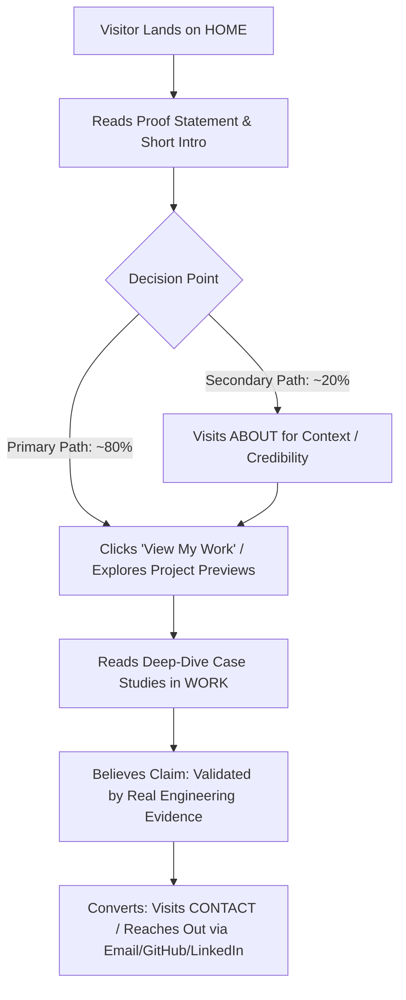

# Portfolio Sitemap & Journey Architecture

## Overview & Positioning

- **Owner:** Vivek (B.Tech CSE Student / Aspiring Software & AI Engineer)
- **Proof Statement:**
  > "I build AI-assisted software and practical engineering projects that turn real problems into working solutions."
- **Primary Visitor Action:** View my projects / case studies
- **Secondary Visitor Action:** Contact / connect with me

---

## 1. High-Level Sitemap Structure

```text
HOME (Landing & Proof Gateway)
├── WORK / CASE STUDIES (Deep Evidence & Problem-Solution Breakdown)
├── ABOUT (Background, Engineering Philosophy & Capabilities)
└── CONTACT (Direct Channels & Professional Links)
```

> **Design Principle:** Every page earns its place. No bloat (no separate skills page, resume page, blog, or testimonials page unless justified by evidence).

---

## 2. Page-by-Page Content & Intent

### 1. `HOME` (Landing & Core Gateway)
* **Goal:** Hook the visitor, state the proof statement immediately, show curated proof previews, and guide them to the primary action.
* **Sections:**
  1. **Hero Section:**
     - Name & headline.
     - **Proof Statement:** *"I build AI-assisted software and practical engineering projects that turn real problems into working solutions."*
     - **Primary CTA:** `View My Work` (leads to `/work` or `#work`).
     - **Secondary CTA:** `Get in Touch` (leads to `/contact`).
  2. **Short Introduction:**
     - 2–3 sentences on engineering focus (B.Tech CSE) and practical problem-solving using AI collaboration.
  3. **Selected Project Previews (Top Evidence):**
     - *AI Video Restoration Pipeline:* Problem, technical architecture, and visual/performance result.
     - *AIPS (AI-Powered Portfolio/System):* Problem solved, AI workflow integration, working solution.
     - *Additional Engineering/Frontend Project:* Practical utility and software craftsmanship.
     - *Card Action:* Direct link to full case study for each project.
  4. **Bottom Conversion Band:**
     - Reiteration of Primary CTA: `Explore All Case Studies`.

---

### 2. `WORK / CASE STUDIES` (Proof & Technical Verification)
* **Goal:** Prove technical competence, problem-solving capability, and verification discipline through deep-dive case studies.
* **Structure for Each Case Study:**
  - **Context & Problem:** What real-world problem needed solving?
  - **Technical Implementation & Architecture:** Technologies used, algorithms, pipeline flow, and AI-assisted tooling.
  - **Engineering Verification & Decisions:** How the solution was validated, edge cases handled, and personal technical ownership.
  - **Measurable Outcome / Working Solution:** Demo links, repositories, and tangible results.
* **Featured Projects:**
  1. **AI Video Restoration Pipeline** (Computer Vision, AI models, automation pipeline).
  2. **AIPS / AI-Powered Portfolio Project** (AI workflow, intelligent retrieval/processing).
  3. **Core Software & Engineering Projects** (Frontend/systems, full-stack applications).

---

### 3. `ABOUT` (Who I Am & Engineering Identity)
* **Goal:** Briefly establish background, credibility, and engineering mindset without distracting from projects.
* **Sections:**
  1. **Academic Background:** B.Tech in Computer Science and Engineering (CSE).
  2. **Technical Focus & Stack:** Applied AI, software engineering, modern frontend/systems development.
  3. **How I Work (AI as a Collaborator):** How I leverage AI tools to accelerate development while taking full ownership of architecture, debugging, and verification.
  4. **Direct Call to Action:** Link to Case Studies or Contact.

---

### 4. `CONTACT` (Conversion & Connection Channels)
* **Goal:** Provide frictionless communication paths for recruiters, collaborators, and clients.
* **Direct Channels:**
  - **Direct Email:** Plaintext clickable link (`mailto:`).
  - **GitHub:** Code repositories, active commits, and open-source work.
  - **LinkedIn:** Professional profile and networking.

---

## 3. Visitor Journey & Funnel Flow



---

## 4. Evaluation Checklist

- [x] **Small & Focused:** Exactly 4 interconnected views (Home, Work, About, Contact).
- [x] **Earned Value:** No fluff pages (no standalone resume/blog/testimonials).
- [x] **Action-Oriented:** Every view funnels toward *View my projects / case studies*.
- [x] **Evidence-Driven:** Built to prove practical AI engineering with real projects.
